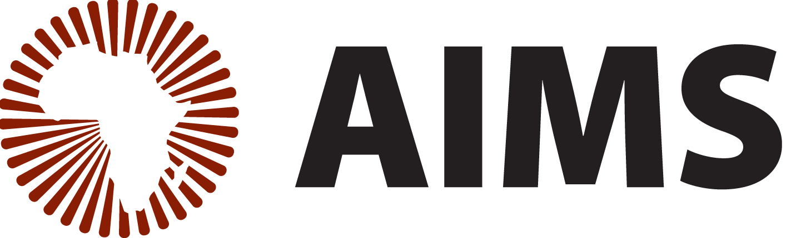

---
---

# Full programme

#### 24 March, Day 1
***Refresher***
1. Welcome: Introductions (9.00 - 9.30)

2. Recap python basics and Bayesian inference (09.30 – 10:30)

3. Break (10.30-11.00)

4. Lecture: Statistical learning (11.00-12.00)

5. Lecture: Intro to Stan  (12.00 - 12.30)

6. Lunch (12.30 - 13.30)

7. Lecture: Intro to Stan (continued) (13.30 - 14.00)

8. Hands-on: Introduction to statistical learning with Stan in python (14.00 - 16.00)

#### 25 March, Day 2
***Scalable Gaussian process regression models in Stan***

1. Recap session and Q&A in break-out rooms (max 10 ppl) (09.00 - 09.30)

2. Lecture: Intro to Gaussian processes (09.30-10.30)

3. Break (10.30-11.00)

4. Lecture: Scalable Gaussian process regression models in Stan (11.00-11.30)

5. Lunch (12.30-13.30)

6. Inspirational Lecture: Two research talks from the Machine Learning and Global Health Network (13.30 - 14.30)

7. Hands-on: Scalable Gaussian process regression models (14.00-16.00)

8. Social: BBQ or similar (18.00 - 20.00)

#### 26 March, Day 3
***Gaussian processes continued***

1. Recap session and Q&A in break-out rooms (max 10 ppl) (09.00 - 09.30)

2. Lecture/Hands-on: Scalable Gaussian process regression models (09:30 – 10:30)

3. Break (10.30-11.00)

4. Group project (11.00 - 12.30)

5. Lunch (12:30-13:30)

6. Group project continued (13.30 - 15.00)

7. Groups present (15.00-16.00)

#### 27 March, Day 4
***Infectious Disease Modelling with Stan***

1. Lecture: Introduction to Infectious Disease Modelling and Compartmental Modelling (09.00-10:20)

2. Break (10.20-10.50)

3. Practical: Deriving simple SIR type models with pen and paper (10:50 – 11:30)

4. Practical: SIR models in Stan (11.30-12.30)

5. Lunch (12:30-13:30)

6. Inspirational Lecture: Local research talks (two-three) (13.30 - 14.30)

7. Practical: SIR models in Stan (continued) (14.30-16.00)

#### 28 March, Day 5
***Phylogenetics***

1. Lecture: Introduction to phylogenetics (09:00-10:30)

2. Break (10.30-11.00)

3. Practical: Running a phylogenetic pipeline (11:00-12:30)

4. Lunch (12:30-13:30)

5. Guided practical: More phylogenetics (13:30 – 14:30)

6. Wrap-up (14:30 – 15:00)
