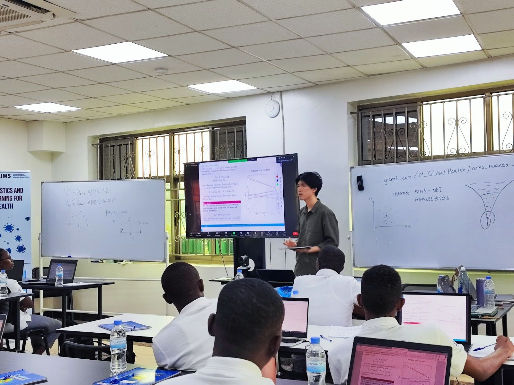
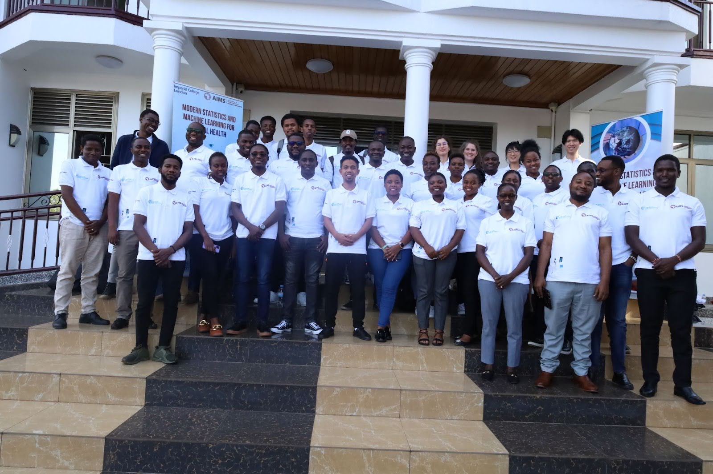
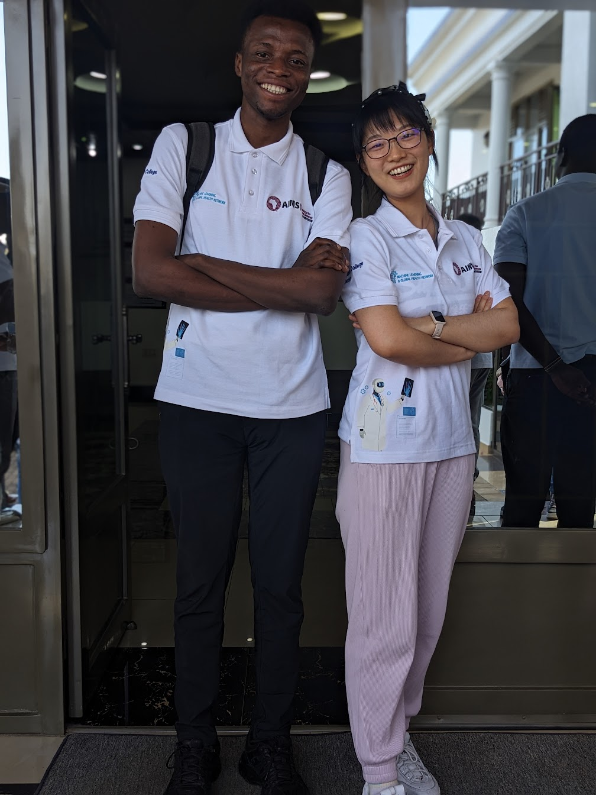
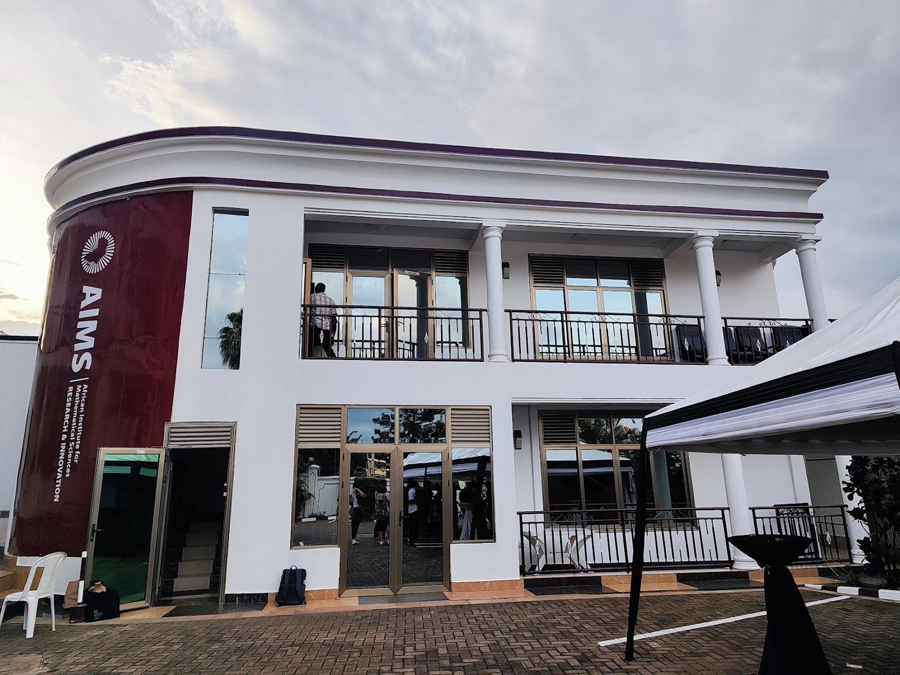

In February 2024, 4 members of the Machine Learning and Global Health Network visited AIMS Rwanda to deliver a 3-day workshop on modern methods at the intersection of epidemiology, statistical modelling and computer science, including probabilistic programming using Stan, computationally efficient non-parametric Bayesian inference, statistical techniques for infectious disease modelling and public health, and phylogenetics.

## Course Contents

***Thursday  February 22*** 

Lecture 1: Introductions (9.00-9.30) 

**Bayesian Inference** 

Lecture 2: Introduction to Stan for applied Bayesian analyses (9.30-10.00) 

Practical 1: Stan basics (10.00-11.30) 

Lecture 3: Scalable Gaussian process regression models (11.45-12.30) 

Practical 2: Scalable GP regression models (12.30-13.00) 

Practical 2: Scalable GP regression models continued (14.00-16.00) 

***Friday  February 23*** 

***Infectious Disease Modelling*** 

Lecture 4: Introduction to Infectious Disease Modelling (09.00-10:00) 

Lecture 5: Introduction to phylogenetics (10:00-10:40) 

Lecture 6: (11.00-13:00) Four remote research talks from the Machine Learning and Global Health Network (Oliver Ratmann, Seth Flaxman, Samir Bhatt, Liza Semenova)

Practical 3: Running a phylogenetic pipeline (14:00-15:00) 

Lecture 6: SIR models (15:00-16:00) 

***Saturday  February 24*** 

Practical 4: Deriving SIR type models (09:00-10:30) 

Lecture 7: Introduction to Fitting an SIR model practical (10:45-11:00) 

Practical 5: Fitting an SIR model in Stan (11.00-13.00) 

**Course material**
All course material is freely available from https://github.com/MLGlobalHealth/aims_rwanda_2024

## Course testimonials and 📸
A few quotes from the course:

_“The course is very important. In this era of AI and Machine learning, it may be the time to train more youngsters and senior researchers to explore more about the use of AI in the field of modelling and treating communicable diseases.”_

_“I have been enjoying the content and learning Modern Statistics and Machine Learning for Global Health, methodology used was really valuable.”_

  
  <figcaption text-align: center></figcaption>
  
  <figcaption text-align: center></figcaption>
  
  <figcaption text-align: center></figcaption>
  
  <figcaption text-align: center></figcaption>
  
  <figcaption text-align: center></figcaption>
  
  <figcaption text-align: center></figcaption>

